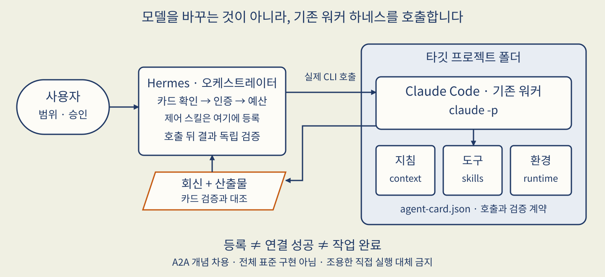
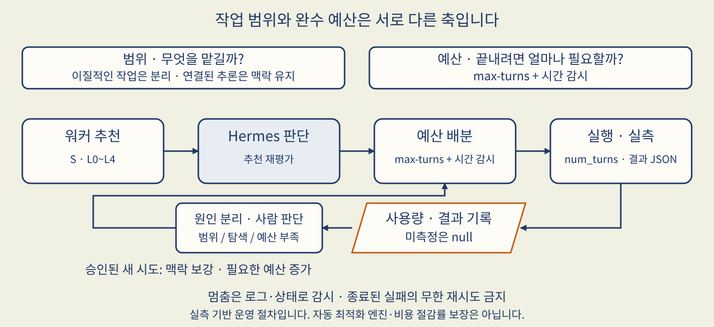

# codex-cli-control

> **Hermes가 프로젝트에 결합된 기존 Codex CLI 하네스를 실제로 호출하고, 결과까지 대조하는 제어 스킬입니다.**
>
> 배포 버전 **4.3.0** · Linux/WSL · Hermes 오케스트레이터용 전체 폴더 패키지

## 해결하려는 문제 — 모델에게 묻는 것과 워커에게 맡기는 것은 다릅니다

이미 특정 프로젝트 폴더에서 Codex CLI를 사용하고 있다고 가정해 봅시다. 그 워커는 프로젝트 지침을 읽고, 그곳의 스킬·도구·실행환경으로 일을 합니다. 여기서 **하네스**는 모델 이름이 아니라, 모델의 추론과 도구 실행을 연결하는 CLI 프로그램 및 실행 규칙을 뜻합니다.

Hermes에게 “저 프로젝트의 Codex CLI에게 맡겨 줘”라고 했는데 Hermes가 직접 파일을 수정하거나 다른 에이전트를 만들었다면, 산출물이 맞아도 요청한 실행 경로는 지켜지지 않은 것입니다. 같은 모델을 선택하는 것만으로 기존 하네스의 지침·권한·환경이 이어지지도 않습니다.

이 스킬은 **누구를 호출했는지, 어느 폴더의 계약을 읽었는지, 결과를 무엇으로 검증했는지**를 분리해 확인합니다. 새 워커를 배포하는 설치기가 아니라, 이미 독립적으로 운영되는 워커를 Hermes가 제어하는 절차와 검증 도구의 묶음입니다.

## 큰 그림 — Hermes는 조율하고, 기존 워커는 자기 환경에서 실행합니다



- **오케스트레이터(Hermes)**: 작업 범위·난이도·예산을 정하고 호출 결과를 검수합니다. 이 제어 스킬은 여기에 등록합니다.
- **워커(Codex CLI)**: 타깃 프로젝트의 지침과 기존 도구·환경으로 실제 작업을 수행합니다. 제어 스킬을 워커에 중복 설치하지 않습니다.
- **Agent Card(`agent-card.json`)**: 워커가 제공하는 기능(capability), 호출 방법, 검증 방법을 알려 주는 로컬 계약서입니다. 카드가 있다고 실제 기능이 동작하는 것은 아니므로 첫 통신으로 대조합니다.
- **독립 검증**: “완료했습니다”라는 회신과 별개로 Hermes가 파일·명령 결과·서버 상태 등 작업의 도착점을 확인합니다.

A2A에서 capability discovery(가능한 작업 탐색), 작업 상태, 결과 검증의 개념을 차용했습니다. **A2A 전체 표준이나 네트워크 프로토콜을 구현한 패키지는 아닙니다.**

### Hermes 기본 위임·Kanban과 무엇이 다른가요?

| 선택지 | 실제 실행 주체와 역할 |
|---|---|
| `delegate_task` | 새 컨텍스트의 Hermes 자식 AIAgent입니다. 다른 provider/model과 `max_iterations`를 사용할 수 있고, 최신 공식 문서는 최상위 background 위임도 설명합니다. |
| Kanban | 영속 SQLite 작업보드와 named Hermes profile의 OS 프로세스로 작업을 관리합니다. workspace/worktree, retry/reclaim, 사람의 판단 대기를 지원합니다. |
| 이 스킬 | 기존 타깃 프로젝트의 **외부 Codex CLI 하네스 자체**를 `codex exec`로 호출하고 검증합니다. |

차이는 타 provider 사용이나 폴더 지정 가능 여부가 아니라 **어떤 하네스가 실행하느냐**입니다. Kanban 워커인 Hermes가 이 스킬로 외부 CLI를 호출하는 조합도 가능합니다. 서로 대체 우위를 주장하지 않습니다. 또한 완료 이벤트가 저장된다는 사실과 중단된 외부 CLI 실행이 자동 복구된다는 주장은 다릅니다.

## 사용자와 에이전트의 대화로 보는 사용법

아래는 사용 흐름을 설명하는 **예시 대화이며 실제 실행 기록은 아닙니다.**

> **사용자**: 이 프로젝트의 Codex CLI에게 승인된 작업 하나를 맡겨 줘. 다른 폴더는 건드리지 마.
>
> **Hermes**: 먼저 카드와 프로젝트 지침을 읽고 인증 후보를 확인하겠습니다. 첫 호출은 읽기 전용입니다. 워커가 보고한 정체성·가능한 작업을 카드와 대조한 뒤 예산을 정하겠습니다.
>
> **워커**: 이 작업은 단일 산출 단계입니다. 예상 단계와 난이도 추천을 보고합니다. 추가 설치가 필요하면 실행 전에 묻겠습니다.
>
> **Hermes**: 추천 난이도를 검토해 범위와 예산을 확정했습니다. 결과 회신 뒤에는 카드의 검증 절차를 독립 실행하겠습니다. 호출에 실패하면 제가 대신 처리한 것을 워커 성공으로 보고하지 않겠습니다.

## 설치 여정 1 — Hermes에 전체 스킬 폴더 등록하기

준비물은 Hermes Agent, Python 3, Bash, `codex` CLI와 해당 워커의 인증 환경입니다. Hermes에는 `terminal`, `file` 도구가 필요합니다. 서버 HTTP 검증은 `curl`, 변경 대조는 Git 등 선택한 검증 절차의 도구도 준비합니다. 외부 패키지를 이 안내가 자동 설치하지는 않습니다.

**기본 배포 경로는 신뢰할 수 있는 로컬 전체 폴더 복사입니다.** `SKILL.md`만 떼어 복사하지 마세요. 아래 Bash 블록의 `SOURCE`를 받은 패키지의 절대경로로, `PROFILE`을 설치할 기존 프로필로 바꿉니다. `default`는 기본 홈, 다른 이름은 named profile입니다. 커스텀 홈을 사용한다면 `DEST_HOME`도 해당 프로필의 실제 홈으로 명시해야 합니다.

```bash
(
  set -euo pipefail
  SOURCE="/absolute/path/to/codex-cli-control"
  PROFILE="default"  # 예: research. 기존 프로필만 사용
  if [ "$PROFILE" = default ]; then
    DEST_HOME="$HOME/.hermes"
  else
    DEST_HOME="$HOME/.hermes/profiles/$PROFILE"
  fi
  export HERMES_HOME="$DEST_HOME"
  test -f "$SOURCE/SKILL.md"
  test -f "$DEST_HOME/config.yaml"  # 다른 홈을 새 프로필로 오인하지 않음
  DEST="$DEST_HOME/skills/codex-cli-control"
  if [ -e "$DEST" ] || [ -L "$DEST" ]; then
    printf '중단: 기존 스킬을 보존합니다: %s\n' "$DEST" >&2
    exit 1
  fi
  mkdir -p "$DEST_HOME/skills"
  mkdir "$DEST"  # 검사 이후 충돌도 중단: 기존 경로로 복사하지 않음
  cp -R "$SOURCE/SKILL.md" "$SOURCE/references" "$SOURCE/scripts" \
    "$SOURCE/assets" "$SOURCE/README.md" "$SOURCE/LICENSE" \
    "$SOURCE/PACKAGE_MANIFEST.json" "$DEST/"
  hermes --profile "$PROFILE" skills list
)
```

목록에서 `codex-cli-control`이 나타나는지 확인합니다. 복사 도중 실패하면 성공으로 보지 말고 생성된 목적지를 조사하세요. 재실행으로 덮어쓰지 않습니다. 실행 중인 **같은 프로필** 세션에서 `/reload-skills` 후 `/skill codex-cli-control`으로 로드하거나 새 세션을 시작합니다. 목록 등재는 등록 확인일 뿐 워커 연결 성공이 아닙니다.

GitHub 배포를 선택할 때 `owner/repo/skills/codex-cli-control` 같은 식별자는 **형식 예시**이며 이 README가 원격 발행을 보증하지 않습니다. 실제 출처를 확인하고 `hermes --profile PROFILE skills inspect <실제 식별자>`로 검사하세요. HTTP/GitHub 다운로드는 명시적으로 참조된 지원 파일만 포함할 수 있으므로 README·assets·간접 참조까지 전부 설치된다고 가정하지 않습니다. 설치 후 전체 파일 목록과 manifest를 대조해야 합니다.

## 설치 여정 2 — 타깃 프로젝트와 워커 연결하기

스킬 등록과 **프로젝트 커플링(연결 계약 확인)**은 별개입니다. 아래 지시문을 타깃을 관리하는 코드에이전트에게 전달할 수 있습니다. 경로와 승인 범위를 채우되 인증 토큰은 넣지 않습니다.

```text
오케스트레이터 스킬: codex-cli-control 4.3.0
스킬 위치: <설치된 스킬 절대경로>
타깃 프로젝트: <기존 워커 프로젝트 절대경로>
허용 작업: 우선 조사와 연결 계획만. 승인 전 타깃 파일 변경 금지.

1. 타깃의 기존 지침, agent-card.json, CLI 설정·도구·실행환경을 조사하라.
   카드가 선언한 context_file이 해당 CLI에서 실제 로드되는지 확인하라.
   기존 카드와 지침은 보존하고, 확인한 경로·필드·불일치만 보고하라.
2. 카드가 없으면 임의 스키마나 기본값을 만들어 진행하지 마라.
   SKILL.md와 references/common-rules.md의 소비 필드 및 기존 프로젝트 계약을
   조사하여 필요한 카드 계약·소유자·검증 방법·변경 계획을 먼저 제시하라.
   사람이 계약을 승인한 뒤에만 타깃 소유 워커가 그 계약대로 작성·갱신하라.
3. Hermes의 제어 스킬을 워커에 복제하지 마라. 기존 프로젝트 지침·도구·환경을
   교체하거나 새 installer, proxy, 자동 복구 장치를 만들지 마라.
4. 승인된 인증 후보 경로로 패키지 preflight를 실행하라. 비밀 값은 출력하지 마라.
   인증 불명·CLI 부재·통신 실패면 원문 오류와 차단 이유를 보고하고 멈춰라.
5. Hermes에서 SKILL.md Step C의 첫 read-only discovery를 실제 CLI로 호출하라.
   작업 디렉터리를 명시하고 카드·컨텍스트만 읽도록 제한하라.
   회신에는 정체성, context_file, capability, 난이도 추천·계획·사람 판단 필요 여부를 받는다.
6. 회신을 카드·실제 파일과 대조하고 실행 전후 diff/status를 비교하라.
   사전부터 있던 변경은 구별하라. Git 밖 파일도 승인된 감시 범위에서 대조하라.
   CLI 자체의 세션/로그 쓰기와 프로젝트 업무파일 변경을 구별하라.
7. 등록 여부, preflight, 실제 호출 여부, identity 대조, 변경 대조, 남은 장애를
   각각 보고하라. 첫 연결 성공만으로 본작업 완료를 주장하지 마라.
```

이 패키지에는 카드 생성 스키마나 타깃 자동 설치기가 없습니다. 위 내용은 **기존 계약을 조사하고 승인받는 운영 지시**입니다. `preflight_codex_home.sh`는 [scripts/preflight_codex_home.sh](scripts/preflight_codex_home.sh)에 있습니다. Codex preflight는 CLI 존재와 후보 `CODEX_HOME`의 비어 있지 않은 `auth.json`만 확인해 `CODEX_HOME_READY`를 반환합니다. 토큰 유효성이나 모델 통신 성공의 증거는 아닙니다. 실제 호출은 discovery에서 확인합니다. `-o`는 마지막 메시지 파일이고, `--json` 이벤트 스트림은 별도로 캡처합니다.

## 실제 작업 여정 — 확인 → 예산 → 호출 → 검증

### 1. 카드와 첫 통신에서 “이 워커가 맞는가”를 확인합니다

`agent-card.json`의 `agent_os`, `workspace.context_file`, 요청에 맞는 `skills[]`의 호출·검증 정보를 읽습니다. `none`은 의도적 부재, `default`는 기본 동작 위임이고, `null`·`unknown`은 보고 후 판단할 미확정 상태입니다. 카드 전체 예제를 임의로 채우지 않습니다.

preflight가 통과하면 [SKILL.md의 Step C](SKILL.md)에 있는 읽기 전용 호출을 사용합니다. 정체성만 묻는 데 권한 우회 옵션을 쓰지 않습니다. 워커의 난이도 추천도 이 회신에 함께 받아 불필요한 별도 왕복을 줄입니다.

### 2. 난이도를 판단하고 충분한 예산을 배분합니다



**작업을 작게 나누는 것과 예산을 적게 주는 것은 다릅니다.** 이질적인 결정론 작업 여러 개는 분리하되, 한 작업이 도구 실행·결과 수신·검증·보고를 마칠 여유는 줘야 합니다. 반대로 전략 수립처럼 추론이 연결된 작업을 무조건 쪼개면 맥락을 다시 만드는 비용이 커집니다.

`grade_recommended`는 워커 추천이고 `grade_assigned`는 Hermes의 최종 판단입니다. S는 정체성 확인, L0~L4는 단일 명령부터 전략·사람 판단 루프까지의 난이도 등급입니다. **배분 수치의 정본은 [timeout-budget-grades.md](references/timeout-budget-grades.md)**입니다. 이 패키지는 Codex에 `--max-turns`를 붙이지 않습니다. 예산은 Hermes 호출 래퍼의 `timeout`이며, `timeout_allocated_s`와 Hermes가 시작부터 종료까지 측정한 `wall_seconds_used`를 기록합니다. 미측정 값은 `null`입니다. 시간 한도가 토큰·금액의 하드 한도를 뜻하지는 않습니다.

실행 후 `budget_outcome`과 실제 사용량을 원장에 남깁니다. 예산 소진이면 범위 과다·탐색 낭비·진행 중 시간 부족을 구별합니다. 충분한 맥락을 미리 제공하고, 필요 시 더 큰 예산의 **새 제어 시도**를 승인받습니다. 종료된 실패를 무한 자동 재시도하지 않습니다. 멈춤은 진행 로그와 선언된 runtime 상태를 함께 보고 판단합니다.

이것은 **난이도 판단 → 배분 → 실측 → 다음 판단 조정**의 운영 루프입니다. 자동 최적화 엔진이나 비용 절감률 보장이 아닙니다. 참조 문서의 Layer 2 자동 보정은 미구현 청사진입니다. Codex 예산표는 실측 보정 이전의 초기 가정(prior)이며 측정된 최적값이 아닙니다.

### 3. 승인된 작업 하나를 실제 하네스로 호출합니다

`workdir=WS`와 `codex exec -C WS`를 함께 지정합니다. 검증된 `CODEX_HOME`, 카드의 sandbox(`-s`), 결과 경로(`-o`)를 사용합니다. 모델이 명시되면 `-m`, `default`면 생략합니다. `null`은 생략하되 미확정 사실을 보고하고, `unknown`은 추측하지 않고 판단을 요청합니다. 프롬프트에는 작업 범위, 금지 경로·행위, 필요한 입력 발췌, 완료 검증 기준을 넣습니다. L3/L4처럼 긴 작업은 background 실행과 진행 감시를 사용하고, **HITL(Human-in-the-Loop)**, 즉 사람 판단이 필요한 지점에서는 질문을 중계합니다. 권한 확대나 추가 설치를 사람이 모르게 진행하지 않습니다.

### 4. 회신과 산출물을 따로 검증합니다

[출력 parser](scripts/parse_codex_output.py)로 결과를 검사하고, 카드의 `skills[].verification`을 우선 실행합니다. 산출물 검증 도구는 Git 진단과 예상 glob의 파일 존재를 확인합니다. exit 0은 파일 내용·품질·무변경의 완전한 증명이 아닙니다. parser 역시 비어 있지 않은 일반 텍스트를 통과시키므로 실제 산출물과 종료코드를 별도로 확인해야 합니다.

**제어 경로(control-plane)**가 정상이라는 것과 **실제 결과(data-plane)**가 맞다는 것을 분리합니다. 결과 검증 전에는 `completed`로 보고하지 않습니다. [실행 원장](references/primary-fallback-policy.md)에 실제 호출 여부, 상태, 예산, 증거 경로, fallback 여부를 남깁니다. Hermes 직접 실행이나 `delegate_task`로 바꿨다면 “primary 실패 + fallback”이지 Codex CLI 제어 성공이 아닙니다.

## 왜 두 스킬로 나눴나요?

공유하는 판단 규칙은 같지만 하네스의 인증·권한·출력·예산 구현이 다릅니다. 한쪽 명령을 이름만 바꿔 쓰면 오작동합니다.

| 계약 | claude-code-control | codex-cli-control |
|---|---|---|
| 실제 호출 | `claude -p` (print mode) | `codex exec` (`-p`는 profile) |
| 인증 위치 확인 | `HOME` 후보 + auth status | `CODEX_HOME` 후보 + auth.json 존재, 실제 통신은 discovery |
| 작업 디렉터리 | Hermes `workdir` | Hermes `workdir`와 Codex `-C` |
| 권한 | `--allowedTools` | sandbox `-s` |
| 결과 | `--output-format json` | `-o` 마지막 메시지, 선택 `--json` 이벤트 |
| 예산 | `--max-turns` + 별도 시간·로그 감시 | 호출 래퍼 `timeout` + 로그 감시; max-turns 아님 |

## 안전 경계와 검증 방법

- 등록·인증 사전 확인·첫 통신·본작업·독립 검증은 서로 다른 관문입니다. 하나의 성공을 전체 성공으로 확대하지 않습니다.
- 패키지는 기존 카드·프로젝트 지침·인증정보를 자동 생성하거나 바꾸지 않습니다. 전송 실패 때 proxy나 서비스를 임의로 설치·기동하지 않습니다.
- 원격 발행, 실제 프로필 설치, 타깃 연결, 유료 모델 호출은 별도 승인과 실행 증거가 필요합니다.
- 아래 자체 테스트는 **LLM·네트워크 없는 결정론 회귀**입니다. 통과해도 live CLI 연결 성공은 아닙니다. 스킬 감사에서 “설치된 hub 스킬 없음”이 나와도 이 패키지의 보안 PASS를 뜻하지 않습니다.

설치된 패키지 루트에서 실행합니다. 테스트 임시파일은 `TMPDIR`로 격리할 수 있습니다.

```bash
python3 -B scripts/test_codex_control_scripts.py
bash -n scripts/preflight_codex_home.sh
bash -n scripts/verify_artifacts.sh
python3 -B -c 'import ast,pathlib; [ast.parse(p.read_text()) for p in pathlib.Path("scripts").glob("*.py")]'
```

`PACKAGE_MANIFEST.json`은 자기 자신과 Git 메타데이터·캐시·로그를 제외한 배포 파일의 SHA-256, 크기, mode 목록입니다. 출처를 인증하는 서명이나 타깃 설치 영수증은 아닙니다. 목록·해시 일치 확인과 위 테스트 뒤에도 실제 연결에는 별도의 read-only discovery 및 결과 대조가 필요합니다.

## 더 읽을 문서

| 파일 | 읽는 이유 |
|---|---|
| [SKILL.md](SKILL.md) | Hermes가 따르는 실행 순서와 실제 호출 예시 |
| [공통 규칙](references/common-rules.md) | 카드 소비, 미확정 값, 작업 상태와 결과 검증 |
| [위임 판단](references/delegation-triage-gate.md) | 직접 읽기·결정론 작업·워크플로 위임의 구분 |
| [예산 규칙](references/timeout-budget-grades.md) | 등급별 배분과 실측 기록 |
| [실패 코드](references/failure-codes.md) | 실패 분류와 중단·교정 방향 |
| [Primary/fallback 정책](references/primary-fallback-policy.md) | 실제 호출과 대체 실행의 증거를 구분하는 원장 |

공식 참고: [Hermes Skills](https://hermes-agent.nousresearch.com/docs/user-guide/features/skills) · [Delegation](https://hermes-agent.nousresearch.com/docs/user-guide/features/delegation) · [Kanban](https://hermes-agent.nousresearch.com/docs/user-guide/features/kanban).

라이선스: [MIT](LICENSE).
